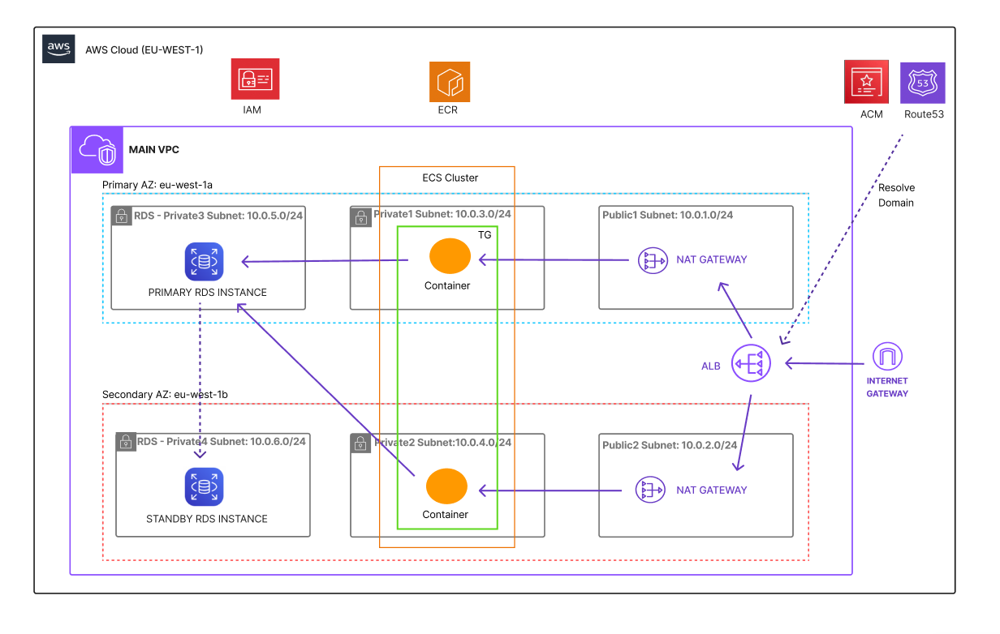

## 🚧 Status: In Progress

This project is a **work in progress**. The core infrastructure is deployed and verified working; the CI/CD pipeline (GitHub Actions) is the last piece being built out.

## Objective

Provision a 3-tier AWS architecture (ALB → ECS → RDS) entirely with Terraform, and automate the build/deploy pipeline with GitHub Actions using OIDC (no long-lived AWS keys). The goal is a repeatable, secure pattern for deploying a containerized app behind a load balancer with a managed database backend.

## Architecture

## Why this design

- **OIDC over static credentials** — avoids long-lived AWS keys in GitHub Actions secrets
- **Multi-AZ RDS in private subnets** — mirrors how a real production database would be isolated and made resilient
- **Remote state with locking** — practicing the workflow needed for team collaboration, not just solo scripting
- **Plan-on-PR / apply-on-merge** — enforces review before infrastructure changes reach the live environment

## What's done

- Full 3-tier infrastructure provisioned via Terraform (39 resources): networking, security groups, ALB, ECS, IAM, RDS
- Remote state configured (S3 backend with native lockfile locking)
- Dockerized Flask app built and pushed to ECR
- ECS service verified healthy behind the ALB (confirmed via target-group health check and direct load test)
- DB password sourced securely via GitHub Actions secret (not committed to `.tfvars`)

## What's left

- [ ] GitHub Actions workflow: OIDC-based pipeline to apply Terraform and build/push the Docker image on merge, with `plan` on PR
- [ ] CI validation for Terraform (`fmt`, `validate`, `plan` as PR checks)
